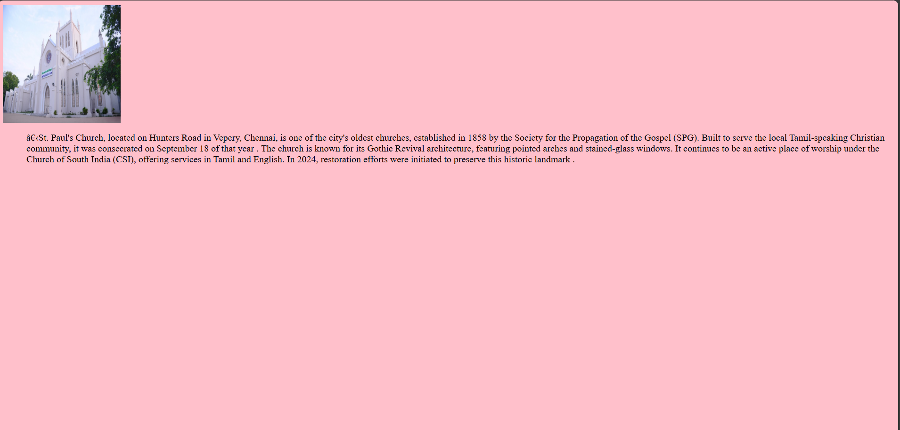
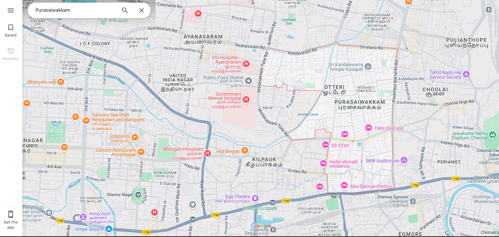
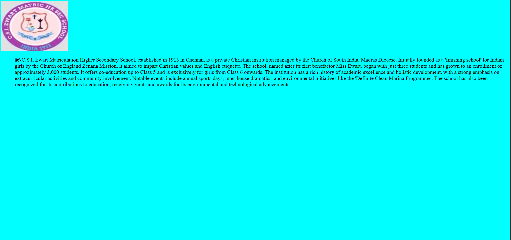
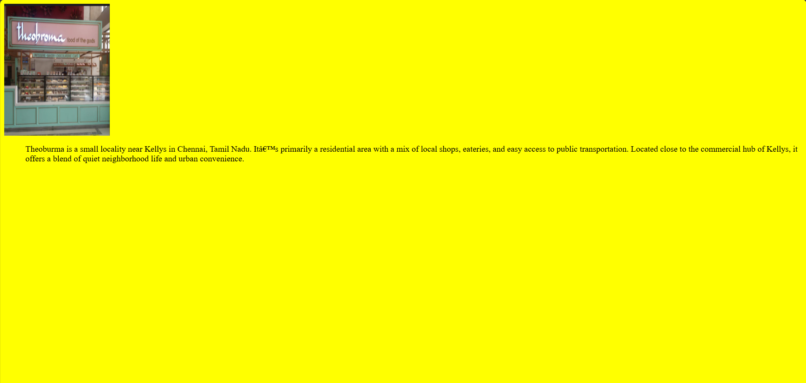

# Ex04 Places Around Me
## Date: 21/4/25

## AIM
To develop a website to display details about the places around my house.

## DESIGN STEPS

### STEP 1
Create a Django admin interface.

### STEP 2
Download your city map from Google.

### STEP 3
Using ```<map>``` tag name the map.

### STEP 4
Create clickable regions in the image using ```<area>``` tag.

### STEP 5
Write HTML programs for all the regions identified.

### STEP 6
Execute the programs and publish them.

## CODE
## church:
```
<BODY>


</BODY>
<BODY BGCOLOR="pink" TEXT="Black">
</BODY>

<UL>
​St. Paul's Church, located on Hunters Road in Vepery, Chennai, is one of the city's oldest churches, established in 1858 by the Society for the Propagation of the Gospel (SPG). Built to serve the local Tamil-speaking Christian community, it was consecrated on September 18 of that year . The church is known for its Gothic Revival architecture, featuring pointed arches and stained-glass windows. It continues to be an active place of worship under the Church of South India (CSI), offering services in Tamil and English. In 2024, restoration efforts were initiated to preserve this historic landmark .
</UL>
```
## school:
```
<BODY>


</BODY>
<BODY BGCOLOR="cyan" TEXT="Black">
</BODY>

<UL>
​C.S.I. Ewart Matriculation Higher Secondary School, established in 1913 in Chennai, is a private Christian institution managed by the Church of South India, Madras Diocese. Initially founded as a 'finishing school' for Indian girls by the Church of England Zenana Mission, it aimed to impart Christian values and English etiquette. The school, named after its first benefactor Miss Ewart, began with just three students and has grown to an enrollment of approximately 3,000 students. It offers co-education up to Class 5 and is exclusively for girls from Class 6 onwards. The institution has a rich history of academic excellence and holistic development, with a strong emphasis on extracurricular activities and community involvement. Notable events include annual sports days, inter-house dramatics, and environmental initiatives like the 'Definite Clean Marina Programme'. The school has also been recognized for its contributions to education, receiving grants and awards for its environmental and technological advancements .
</UL>

```
## theo:
```


<BODY>


</BODY>
<BODY BGCOLOR="Yellow" TEXT="Black">
</BODY>

<UL>
Theoburma is a small locality near Kellys in Chennai, Tamil Nadu.
 It’s primarily a residential area with a mix of local shops, eateries,
 and easy access to public transportation. Located close to the commercial hub of Kellys, 
it offers a blend of quiet neighborhood life and urban convenience.

</UL>
```
## map :
```
<head>
    <UL>
        hi
    </UL>
</head>
<body>


<!-- Image Map Generated by http://www.image-map.net/ -->


<map name="image-map">
    <area target="" alt="theo" title="theo" href="theo.html" coords="924,571,1128,672" shape="rect">
    <area target="" alt="school" title="school" href="school.html" coords="1385,404,128" shape="circle">
    <area target="" alt="church" title="church" href="church.html" coords="1742,333,1616,330,1645,412" shape="poly">
</map>
</body>
```
## OUTPUT:






## RESULT
The program for implementing image maps using HTML is executed successfully.
